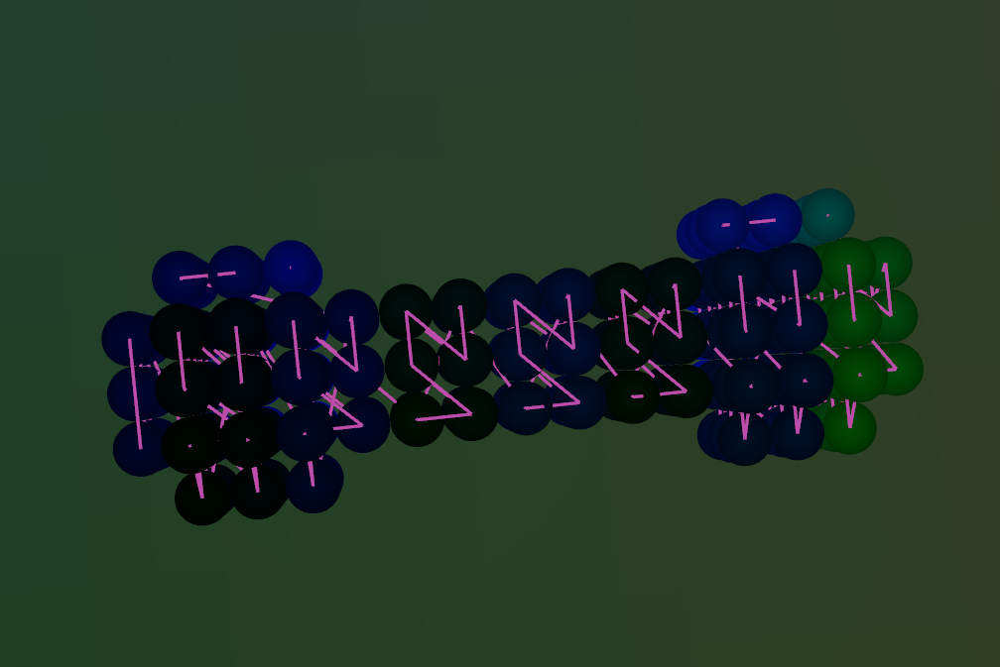

# Visualize Morten code



## Show online
Open [this direct link to rerun.io](
https://app.rerun.io/?url=https://raw.githubusercontent.com/rasmusgo/morten-code/master/data.rrd).

## Show locally
Get [rust](https://www.rust-lang.org/tools/install), then

```sh
cargo run
```
